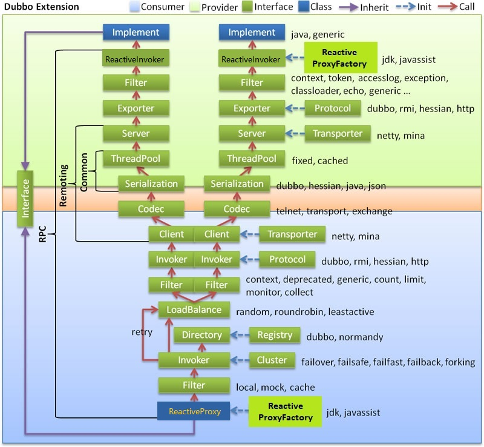

--


Reactive support for [Dubbo](http://dubbo.apache.org) based on [REACTOR](https://projectreactor.io/)

## Getting started
### Install
```bash
# git clone https://github.com/cherrythefatbunny/reactive-dubbo.git
# cd reactive-dubbo
# mvn clean install
```
### Run redis and zookeeper
```bash
# cd demo/redis-and-zookeeper
# nohup mvn spring-boot:run &
```
### Run Demo Provider
```bash
# cd ../provider
# nohup mvn spring-boot:run &
```
### Run Demo Consumer
```bash
# cd ../consumer
# nohup mvn spring-boot:run &
```

## Getting involved

### Maven dependency
Both provider and consumer should add reactive-dubbo-starter dependency
```xml
<dependency>
    <groupId>com.github.cherrythefatbunny</groupId>
    <artifactId>reactive-dubbo-starter</artifactId>
    <version>1.0.2-SNAPSHOT</version>
</dependency>
```
### Service definition
For provider side,you should define reactive services by specifying a reactive proxy factory(e.g.,reactivejavassist,reactivejdk. )
```java
@Service(proxy = "reactivejavassist")
public class ReactiveServiceImpl implements ReactiveService {
    
}
```

## Architecture
### Dubbo with Reactive Dubbo
To make dubbo reactive,Reactive Dubbo will replace invokers and proxies with the reactive ones by specifying a reactive proxy factory


### Reactive proxy
A reactive proxy (the reactiveInvokerInvocationHandler actually works) wraps a formal functional invocation into a reactive publisher

[ReactiveInvokerInvocationHandler.java](https://github.com/cherrythefatbunny/reactive-dubbo/blob/master/reactive-dubbo-extensions/src/main/java/com/github/cherrythefatbunny/reactive/dubbo/extensions/proxyfactory/ReactiveInvokerInvocationHandler.java):
```java
public class ReactiveInvokerInvocationHandler extends InvokerInvocationHandler {
    @Override
    public Object invoke(Object proxy, Method method, Object[] args) throws Throwable {
        //if the invocation returns a publisher,make a publisher wrapping the real invocation
        Class returnType = method.getReturnType();
        if(Publisher.class.isAssignableFrom(returnType)) {
            RpcInvocation invocation = new RpcInvocation(method, args);
            if(Mono.class.isAssignableFrom(returnType)) {
                invocation.setAttachment("Publisher","mono");
                return Mono.fromCallable(() -> {
                    try {
                        return invoker.invoke(invocation).recreate();
                    } catch (Throwable throwable) {
                        if(LOGGER.isWarnEnabled()) {
                            LOGGER.warn("mono call invoker error", throwable);
                        }
                        throw new Exception(throwable);
                    }
                });
            } else if(Flux.class.isAssignableFrom(returnType)) {
                invocation.setAttachment("Publisher","flux");
                return Flux.fromIterable(Mono.fromCallable(() -> {
                    try {
                        return (List)invoker.invoke(invocation).recreate();
                    } catch (Throwable throwable) {
                        if(LOGGER.isWarnEnabled()) {
                            LOGGER.warn("flux call invoker error", throwable);
                        }
                        throw new Exception(throwable);
                    }
                }).block());
            } else {
                //TODO other publishers support
                throw new IllegalArgumentException(
                        String.format("%s not supported now",method.getReturnType().getSimpleName()));
            }
        }
        return super.invoke(proxy, method, args);
    }
}
```

### Reactive invoker
A reactive invoker intercepts a formal remote request and convert its result into publisher's parameterized type(e.g. `Mono<String>` -> `String`,`Flux<String>` -> `List<String>`)

[ReactiveProxyFactory.java](https://github.com/cherrythefatbunny/reactive-dubbo/blob/master/reactive-dubbo-extensions/src/main/java/com/github/cherrythefatbunny/reactive/dubbo/extensions/proxyfactory/ReactiveProxyFactory.java):
```java
public abstract class ReactiveProxyFactory extends AbstractProxyFactory {
    @Override
    public <T> Invoker<T> getInvoker(T proxy, Class<T> type, URL url) throws RpcException {
        Invoker<T> invoker = delegating.getInvoker(proxy, type, url);
        Invoker<T> wrapper = (Invoker<T>) Proxy.newProxyInstance(getClass().getClassLoader(),
                new Class[]{Invoker.class}, new InvocationHandler() {
            @Override
            public Object invoke(Object proxy, Method method, Object[] args) throws Throwable {
                Object ret = method.invoke(invoker, args);
                //extra process dealing with remote requests
                if(method.getName().equals("invoke")&&
                        !LOCAL_PROTOCOL.equals(((RpcInvocation) args[0]).getInvoker().getUrl().getProtocol())) {
                    RpcResult rpcResult = (RpcResult) ret;
                    Object val = rpcResult.getValue();
                    //retrieve real returned value and create new RpcResult
                    if(val instanceof Mono) {
                        Mono mono = (Mono) val;
                        return new RpcResult(mono.block());
                    }
                    //retrieve real returned value,collect with an ArrayList and create new RpcResult
                    if(val instanceof Flux) {
                        Flux<Object> flux = (Flux) val;
                        return new RpcResult(flux.collect(ArrayList::new, ArrayList::add).block());
                    }
                }
                return ret;
            }
        });
        return wrapper;
    }
}
```

### RpcUtilsCracker
Since reactive responses will be the publisher's parameterized type which can cause `HessianProtocolException`
,the consumer side should convert the decode types.Here is my solution: crack the `RpcUtils.getReturnTypes` method with javassist.

[RpcUtilsCracker.java](https://github.com/cherrythefatbunny/reactive-dubbo/blob/master/reactive-dubbo-extensions/src/main/java/com/github/cherrythefatbunny/reactive/dubbo/extensions/rpc/support/RpcUtilsCracker.java):
```java
public class RpcUtilsCracker {
    private static final Logger LOGGER = LoggerFactory.getLogger(RpcUtilsCracker.class);
    private static final String RPCUTILS_CLASS_NAME = "com.alibaba.dubbo.rpc.support.RpcUtils";
    public static void crack() {
        try {
            ClassPool classPool = ClassPool.getDefault();
            classPool.appendClassPath(new LoaderClassPath(RpcUtilsCracker.class.getClassLoader()));
            CtClass ctClass = classPool.get(RPCUTILS_CLASS_NAME);
            CtMethod ctMethod = ctClass.getDeclaredMethod("getReturnTypes");
            //rename method `getReturnTypes` to `getReturnTypes0`
            ctClass.removeMethod(ctMethod);
            ctMethod.setName("getReturnTypes0");
            ctClass.addMethod(ctMethod);
            //add new method `getReturnTypes` according to RpcUtilsCracker.getReturnTypes
            CtClass ctClass1 = classPool.get(RpcUtilsCracker.class.getName());
            ctMethod = new CtMethod(ctClass1.getDeclaredMethod("getReturnTypes"),ctClass,null);
            ctClass.addMethod(ctMethod);
            ctClass.toClass();
        } catch (NotFoundException|CannotCompileException e) {
            LOGGER.error("crack RpcUtils failed",e);
        }
    }
    public static Type[] getReturnTypes0(Invocation invocation) {
        return null;
    }

    /**
     * template method of RpcUtils.getReturnTypes
     * @param invocation the invocation instance of the interface
     * @return return types of the invokee
     * */
    public static Type[] getReturnTypes(Invocation invocation) {
        Type[] types = getReturnTypes0(invocation);
        if(types==null)return null;
        if (types[0] == Mono.class) {
            Class<Mono> returnType = (Class<Mono>) types[0];
            ParameterizedType genericReturnType = (ParameterizedType) types[1];
            return new Type[]{genericReturnType.getActualTypeArguments()[0]};
        }
        if (types[0] == Flux.class) {
            Class<Flux> returnType = (Class<Flux>) types[0];
            ParameterizedType genericReturnType = (ParameterizedType) types[1];
            genericReturnType = ParameterizedTypeImpl.make(List.class,new Type[]{genericReturnType.getActualTypeArguments()[0]},null);
            return new Type[]{List.class, genericReturnType};
        }
        return types;
    }
}
```